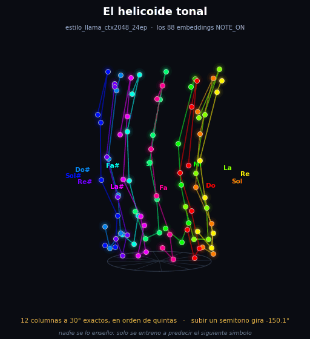
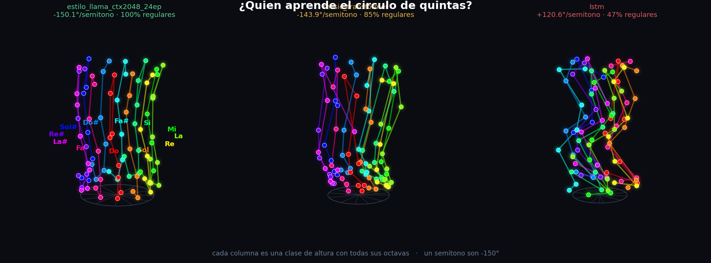
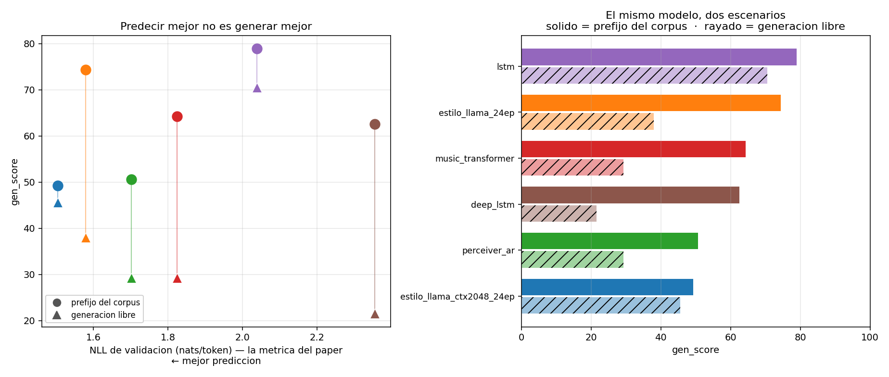

# Music Generation

[](https://huggingface.co/LuisContreras73/music-generation)
[](https://github.com/LuisContreras73/music-generation/releases/tag/v1.0)

Modelos autorregresivos generativos sobre música simbólica de piano. Se entrenan y se
comparan **16 experimentos** de cuatro familias de arquitectura sobre el mismo corpus, la
misma tokenización y el mismo protocolo, y se mide separadamente lo que cada uno **predice**
y lo que cada uno **genera** — que resultan no ser lo mismo.

---

<div align="center">



### El modelo descubrió el círculo de quintas sin que nadie se lo enseñara

Los 88 vectores que el modelo aprende para las notas no caen de cualquier manera. Se colocan
en **doce columnas separadas 30° exactos**, y el orden alrededor del círculo no es el del
teclado: es **Do · Sol · Re · La · Mi · Si · Fa# · Do# · Sol# · Re# · La# · Fa**, el círculo
de quintas. La altura es el eje vertical, así que todas las octavas de una misma nota caen en
la misma columna.

Subir un semitono equivale a girar **−150.1°**. Un paso del círculo de quintas son −150.0°.

Nadie le dio esa información: se entrenó solo para predecir el siguiente símbolo de un
piano-roll binario, sin velocity, sin duración, sin compás y sin nombres de nota.

| | °/semitono | desviación | saltos regulares |
|---|---|---|---|
| `estilo_llama_ctx2048_24ep` | **−150.1** | 11.1° | **100 %** |
| `music_transformer` | −143.9 | 77.8° | 85 % |
| `lstm` | +120.6 | 124.0° | 47 % |

<div align="center">

</div>

El estadístico busca la mejor de 8 componentes, lo que lo infla por construcción, así que se
contrasta con **200 permutaciones** de las filas de embeddings: el azar llega a 0.30
(percentil 95) y los cinco modelos dan **p = 0.005**, el mínimo alcanzable con 200
permutaciones. Es la estructura que la psicología de la música describe desde Shepard (1982)
como hélice de altura.

```bash
python scripts/23_helicoide_tonal.py       # reproduce la figura y las cifras
```

---

## El resultado principal

**Predecir mejor no es generar mejor.** El modelo con mejor verosimilitud es el que peor
música produce, y el que mejor música produce es de los que peor predicen:

| modelo | NLL val (nats/token) | bits/paso | gen_score con prefijo | gen_score libre |
|---|---|---|---|---|
| `estilo_llama_ctx2048_24ep` | **1.5035** | **1.5172** | 49.3 ± 2.4 | 45.6 |
| `estilo_llama_24ep` | 1.5788 | 1.5815 | 74.4 ± 15.3 | 38.0 |
| `perceiver_ar` | 1.7017 | 1.7046 | 50.6 ± 2.6 | 29.3 |
| `music_transformer` | 1.8244 | 1.8276 | 64.3 ± 22.6 | 29.3 |
| `lstm` | 2.0389 | 2.0424 | **78.9 ± 3.0** | **70.5** |
| `deep_lstm` | 2.3551 | 2.3592 | 62.6 ± 2.1 | 21.5 |

*Referencia trivial (i.i.d. con la densidad marginal): 4.0921 bits/paso. Fragmentos reales
del corpus: gen_score 87.6. Ruido con la densidad correcta: 1.6.*



Es un resultado conocido en modelado generativo —Theis, van den Oord y Bethge,
[*A note on the evaluation of generative models*](https://arxiv.org/abs/1511.01844),
ICLR 2016— replicado aquí sobre música simbólica con un protocolo controlado.

### Los otros tres hallazgos

**La decodificación pesa más que la arquitectura.** Con el modelo y los prefijos fijos,
cambiar solo la estrategia de muestreo mueve el `gen_score` hasta **37 puntos**, más que
cualquier diferencia de arquitectura medida aquí. Pero no existe una decodificación buena en
abstracto: la configuración anti-bucle ajustada sobre melodías monofónicas **sobrecorrige**
en prefijos polifónicos del corpus (densidad 0.34 frente a 0.45 real).

**El contexto largo mejora la predicción y empeora la generación.** `estilo_llama_24ep` y
`estilo_llama_ctx2048_24ep` son la misma red con el mismo presupuesto de tokens; solo cambia
el contexto, 1024 frente a 2048. Resultado: 1.5815 → 1.5172 bits/paso, pero 74.4 → 49.3 de
`gen_score`, con rangos que no se solapan.

**La atención relativa sí aporta, y mucho.** `music_transformer` frente a
`ablacion_sin_atencion_relativa`, misma red y mismo presupuesto, solo cambia `rel_attn`:
1.828 frente a 2.802 bits/paso.

---

## Puesta en marcha

```bash
git clone https://github.com/LuisContreras73/music-generation.git
cd music-generation

# torch con CUDA (elige la build de tu GPU en https://pytorch.org/get-started/locally/)
pip install torch --index-url https://download.pytorch.org/whl/cu128
pip install -r requirements.txt
```

Funciona en CPU, pero la generación es entre 10 y 50 veces más lenta.

### Descargar los pesos

Los checkpoints **no están en el árbol de git**, porque GitHub bloquea ficheros de más de
100 MB y cada uno pesa entre 91 y 98 MB. Están publicados en dos sitios, con el mismo
contenido; elige el que prefieras.

**Hugging Face** (recomendado: descarga selectiva, con caché y reanudación)

```bash
pip install huggingface_hub
python -c "
from huggingface_hub import hf_hub_download
import shutil, pathlib
for m in ['lstm', 'music_transformer', 'estilo_llama_ctx2048_24ep']:
    p = hf_hub_download('LuisContreras73/music-generation', f'{m}/best.pt')
    d = pathlib.Path('experiments')/m/'checkpoints'; d.mkdir(parents=True, exist_ok=True)
    shutil.copy(p, d/'best.pt'); print('listo:', m)
"
```

👉 https://huggingface.co/LuisContreras73/music-generation — incluye además un WAV de cada
modelo componiendo desde cero, para escuchar sin instalar nada.

**Release de GitHub** (sin dependencias, solo `curl`)

```bash
mkdir -p experiments/lstm/checkpoints
curl -L -o experiments/lstm/checkpoints/best.pt   https://github.com/LuisContreras73/music-generation/releases/download/v1.0/lstm_best.pt
```

En los dos casos la regla es la misma: el fichero va a
`experiments/<nombre_del_modelo>/checkpoints/best.pt`.

Publicados: `lstm`, `music_transformer`, `estilo_llama_ctx2048_24ep`, `estilo_llama_24ep` y
`perceiver_ar`. De cada experimento se publica `best.pt`, el de menor `val_bpt`; no se
publican `best_gen.pt` (elegido por una métrica ruidosa) ni `last.pt` (309 MB, solo sirve
para reanudar el entrenamiento).

---

## Inferencia

```bash
# qué modelos hay, con sus métricas
python scripts/infer.py --list

# componer desde cero, 40 s
python scripts/infer.py --exp lstm --scratch --seed 7 --seg 40

# continuar una pieza del corpus
python scripts/infer.py --exp music_transformer --corpus 0 --seg 40

# continuar tus propios prefijos (formato .npz del dataset)
python scripts/infer.py --exp lstm --npz mis_prefijos.npz
```

Sale `.wav`, `.mid`, `.npz` y `.png` en `reports/audio/`, ordenado por escenario. La semilla
atraviesa el muestreo, así que **dos ejecuciones con la misma semilla dan el mismo fichero**.

### Sobre `--sampling`

| valor | qué es | cuándo |
|---|---|---|
| `baseline` | T 1.0, top-p 0.95 (la del entrenamiento) | prefijos del corpus y generación libre |
| `best` | calibrada anti-bucle (`data/processed/best_sampling.json`) | melodías monofónicas fuera de distribución |
| `greedy` | argmax | para ver la degeneración en estado puro |

**Medido**: sobre prefijos del corpus `baseline` gana en 5 de 6 modelos; sobre las melodías
de prueba gana `best`. Los detalles están en `docs/03_resultados.md`, sección 7.

---

## Evaluación

```bash
# continúa los .npz de prefijos de prueba con el mejor modelo
python scripts/10_external_eval.py

# comparación pareada: mismos prefijos de test para todos, varias semillas
python scripts/18_comparacion_pareada.py

# generación libre comparable entre modelos
python scripts/20_generacion_libre.py

# las métricas en la unidad del paper de Music Transformer (NLL nats/token)
python scripts/21_metricas_paper.py
```

### Cómo se mide

**`bits/paso`** = `−log₂ p(piano_roll) / n_pasos`. Es la métrica principal porque permite
comparar familias distintas: la tokenización es biyectiva (round-trip exacto, verificado en
`tests/`), así que eventos y frames asignan probabilidad **al mismo objeto**. La perplejidad
por token no serviría, porque los vocabularios difieren.

**`gen_score`** (0-100) mide similitud distribucional con el corpus: histogramas de altura,
clase de altura, polifonía, intervalos entre ataques, intervalos melódicos y armónicos, más
penalizaciones por densidad y por bucles. Está calibrado por *bootstrap* con anclas
empíricas: música real 87.6, ruido con la densidad correcta 1.6, bucle degenerado 0.0.

> **Límite conocido de `gen_score`**: son estadísticos **marginales**. Dicen que las notas se
> reparten como en la música real; no dicen si la secuencia tiene sentido musical. Un modelo
> puede clavar todos los histogramas y sonar incoherente. El paper de Music Transformer
> resuelve esto con un **test de escucha humano**, no con una métrica automática.

---

## El dato

| | |
|---|---|
| corpus | 10 604 piezas, 714.7 h de piano interpretado, 51.46 M pasos |
| representación | piano-roll de ataques `[T, 88]`, binario, 20 Hz (50 ms), MIDI 21-108 |
| lo que **no** hay | velocity, duración, pedal, compás, tempo |
| particiones | 9544 / 530 / 530 **piezas** (no ventanas), permutación con semilla 1234 |
| tokens | 32.2 M train / 1.83 M val / 1.80 M test |
| vocabulario | 155: `NOTE_ON`×88 + `SHIFT`×64 (1..64 pasos) + `PAD`/`BOS`/`EOS` |

La partición es **por pieza**, así que ninguna ventana de validación comparte pieza con
entrenamiento. El split de test no se usó para elegir ningún checkpoint.

El corpus crudo no se redistribuye. En el repositorio va el corpus **ya tokenizado**
(`data/processed/tokens.bin`, 34 MB), que es lo que necesitan la inferencia y el `gen_score`
calibrado. `rolls_packed.bin` (540 MB, solo para reconstruir audio del corpus real) se queda
fuera; los scripts que lo necesitan avisan si falta.

---

## Estructura

```
src/                    librería
  models/               las 10 arquitecturas (music_transformer, modern, perceiver_ar, lstm, ...)
  data/tokenizer.py     NOTE_ON + SHIFT, biyectivo
  gpu_data.py           corpus y augmentación residentes en VRAM (1.43 ms/batch)
  train.py              bucle de entrenamiento (ruta DataLoader y ruta GPU)
  sampling.py           penalización por repetición, n-gramas, typical, min-p
  metrics.py            gen_score y sus componentes
  evaluate.py           bits/paso, barrido de umbral, calibración
scripts/                el pipeline, numerado en orden de ejecución
experiments/<nombre>/   config.json, logs/metrics.csv, logs/summary.json, figures/
reports/                leaderboard, comparaciones, figuras, audio (MIDI + muestra de WAV)
docs/                   análisis de datos, metodología, resultados, limitaciones, estado del arte
tests/                  causalidad estricta, round-trip del tokenizador, todos los modelos
```

Los nombres de experimento dicen **arquitectura + variable que cambia**.
`estilo_llama_*` usa la receta de LLaMA (RoPE + RMSNorm + SwiGLU + QK-norm opcional)
**entrenada desde cero** con 25.8 M parámetros y vocabulario musical de 155 símbolos: no hay
ningún peso de LLaMA de por medio, y el prefijo «estilo» está para que no se entienda lo
contrario. `reports/nombres_experimentos.json` mapea los nombres de trabajo antiguos.

---

## Reproducir desde cero

```bash
python scripts/01_prepare.py        # tokeniza y particiona
python scripts/02_ref_stats.py      # estadísticos de referencia y calibración de gen_score
python scripts/run_experiments.py   # la matriz de experimentos
python scripts/05_report.py         # docs/03_resultados.md
```

Cada experimento guarda su mejor checkpoint por `val_bpt` y por `gen_score` por separado.
`scripts/19_cola_entrenamiento.ps1` encadena entrenamientos largos con reintento automático,
porque este entorno mata el proceso en silencio cada pocas horas.

---

## Lo que este repositorio **no** demuestra

- **Que la receta LLaMA gane por la arquitectura.** Ese par no está controlado: 321 M tokens
  con augmentación frente a 120 M sin ella. El experimento que lo aislaría
  (`estilo_llama_presupuesto_mt` en `scripts/run_experiments.py`) está definido y sin ejecutar.
- **Ninguna diferencia de `gen_score` menor de ~20 puntos** entre los máximos de
  `reports/leaderboard.csv`: ese número es el máximo sobre evaluaciones con prefijos
  sorteados, y su ruido es de 10 a 22 puntos. Para comparar, usa `reports/comparacion_pareada/`.
- **Equivalencia con las cifras publicadas.** Nuestro NLL y el 1.84 del paper de Music
  Transformer **no son la misma escala**: 155 símbolos sin velocity sobre otro corpus frente a
  388 con velocity sobre MAESTRO. `scripts/21_metricas_paper.py` imprime el aviso cada vez.
- **`deep_lstm`** solo completó el 39 % de su presupuesto (1900 de 4900 pasos): su fila existe
  pero no se compara a igualdad de cómputo.

---

## Referencias

- Huang et al., *Music Transformer* — [arXiv:1809.04281](https://arxiv.org/abs/1809.04281)
- Hawthorne et al., *General-purpose, long-context autoregressive modeling with Perceiver AR* — [arXiv:2202.07765](https://arxiv.org/abs/2202.07765)
- Theis et al., *A note on the evaluation of generative models* — [arXiv:1511.01844](https://arxiv.org/abs/1511.01844)
- Holtzman et al., *The Curious Case of Neural Text Degeneration* — [arXiv:1904.09751](https://arxiv.org/abs/1904.09751)
- Su et al., *RoFormer* (RoPE) — [arXiv:2104.09864](https://arxiv.org/abs/2104.09864)
- Shazeer, *GLU Variants Improve Transformer* — [arXiv:2002.05202](https://arxiv.org/abs/2002.05202)
- Zhang y Sennrich, *Root Mean Square Layer Normalization* — [arXiv:1910.07467](https://arxiv.org/abs/1910.07467)

`docs/05_estado_del_arte.md` marca qué cifras están verificadas contra la fuente primaria y
cuáles no, porque no todas lo están.
